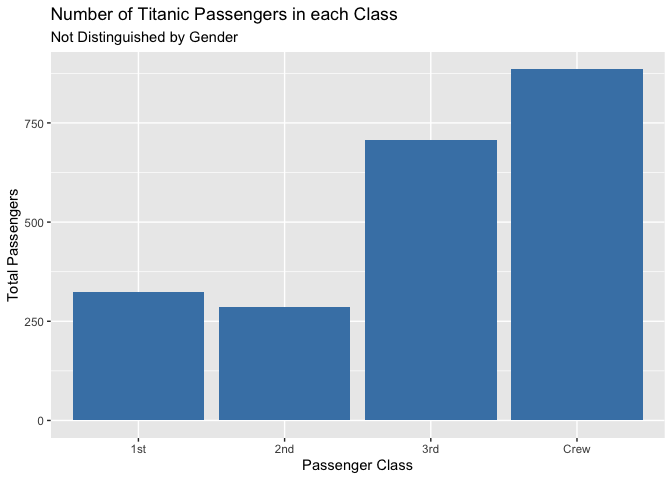
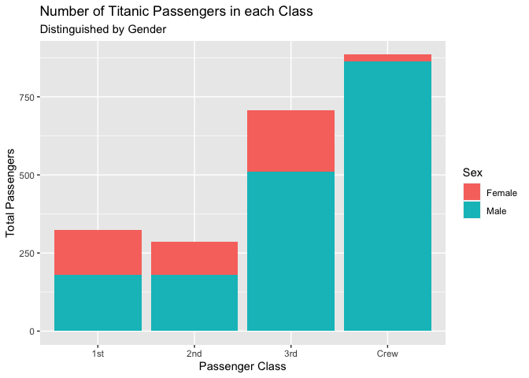

SDS 192-01 PS07: Titantic Regraphing
================
Sena Amuzu
12/01/2021

# Regraphing Example: Number of Individuals in each Class on the Titanic

The **titanic dataset** from the internet contains demographic
information about the 2201 passenengers on the Titanic disaster. *Note
there are 2201 rows in this data, one for each passenger.* The
information provided includes…

-   passenger\_number
-   Class (1st, 2nd, 3rd, Crew)
-   Sex (Female, Male)
-   Age (Adult, Child)
-   Survived (No, Yes)

<!-- -->

    ## Rows: 2201 Columns: 5

    ## ── Column specification ────────────────────────────────────────────────────────
    ## Delimiter: ","
    ## chr (4): Class, Sex, Age, Survived
    ## dbl (1): passenger_number

    ## 
    ## ℹ Use `spec()` to retrieve the full column specification for this data.
    ## ℹ Specify the column types or set `show_col_types = FALSE` to quiet this message.

## a) Number of Titanic Passengers in each Class

**Dplyr commands** are used to output a table that displays the counts
of each Class.

``` r
titanic_classification <- titanic %>% 
  group_by(Class) %>% 
  summarize(Total = sum(n()))
```

### Graph of Number of Titanic Passengers in each Class

``` r
ggplot(titanic_classification, aes(x = Class, y = Total)) +
  geom_bar(stat="identity", fill ="steelblue") + 
  ggtitle("Number of Titanic Passengers in each Class", subtitle = "Not Distinguished by Gender") + 
  labs(x = "Passenger Class", y = "Total Passengers")
```

<!-- -->

## b) Number of Titanic Passengers in each Class Split by Sex

**Dplyr commands** are used output a table that displays the counts of
each Class. *split by sex*

``` r
titanic_classification_gender <- titanic %>% 
  group_by(Sex,Class) %>% 
  summarize(Total = sum(n()))
```

    ## `summarise()` has grouped output by 'Sex'. You can override using the `.groups` argument.

### Graph of Number of Titanic Passengers in each Class, Split by Sex

``` r
ggplot(titanic_classification_gender, aes(x = Class, y = Total, fill = Sex)) +
  geom_bar(stat="identity") + 
  ggtitle("Number of Titanic Passengers in each Class", subtitle = "Distinguished by Gender") + 
  labs(x = "Passenger Class", y = "Total Passengers")
```

<!-- -->

*In every class males out numbered female, especially in the Crew
category. I assume this is due to most of the crew jobs being
laborious.*
